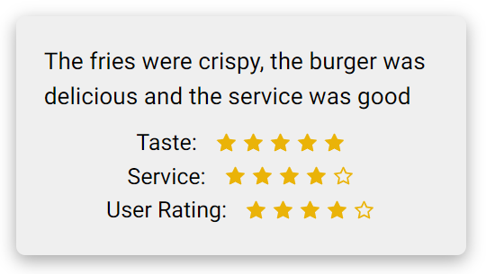

# Review to Rating
## This project is created in the 24 hour Growdash Hackathon organized by COMPEC. 
This is a web app designed for restaurants which work with platforms like UberEats. For large restaurants getting the reviews from those platforms and reading them one by one may not be an option. In this project, we evaluated those reviews for them and organized them so that the restaurant can just look at the ratings we inferred from the reviews. We chose 5 categories for the ratings which are delivery speed, service, price, taste, ambience. The reviews are analyzed and rated on these categories. If the review doesn't have a comment about one of the categories, we don't consider that category for that rating.  
  
For example, the review "It was delicious but it arrived late" is analyzed and it is rated 5 / 5 on taste category but 1 / 5 on delivery speed. Since we have no idea about the other categories based on this review, we don't make an assumption about those.  
  
  
  
We used ChatGPT api for the project. We used directly prompts, however if we had more time we planned to use "fine tuning" on ChatGPT or some other machine learning model for sentiment analysis.  
  
After all, we believe we did a good job and put up this project in 24 hours.  
  
Collaborators: Süleyman Tolga Acar, Mehmet Ali Özdemir, Hasan Arda Güneş
